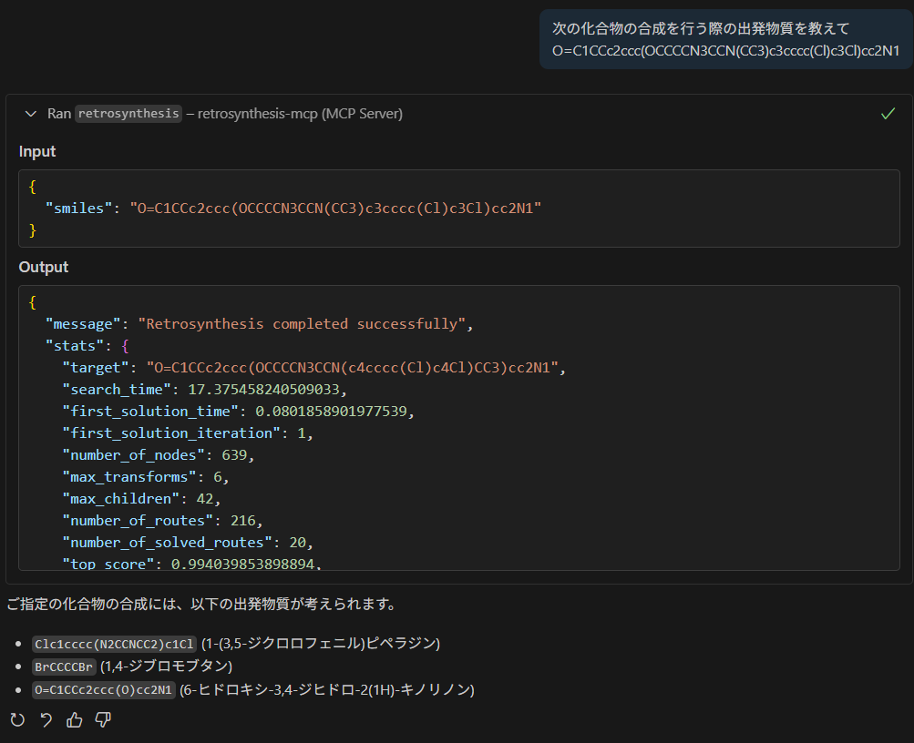

# Retrosynthesis MCP Server

This project implements a Streamable HTTP MCP server for retrosynthesis using FastAPI and AiZynthFinder.

## Setup

1.  **Create and activate a virtual environment (if not already done):**
    ```bash
    uv venv
    source .venv/bin/activate
    ```

2.  **Install dependencies:**
    ```bash
    uv pip install -e .
    ```

3.  **Download AiZynthFinder models and data:**
    This will create a `my_aizynth_data` directory and download necessary model files and a `config.yml`.
    ```bash
    mkdir my_aizynth_data
    uv run download_public_data my_aizynth_data
    ```

## Running the Server

To run the server, use uvicorn:

```bash
uv run uvicorn src.main:app --host 0.0.0.0 --port 8000
```

## 動作イメージ

VSCodeで当該mcp serverを指定し、実行すると次のような結果が得られます。

```json
{
	"servers": {
		"retrosynthesis-mcp": {
			"url": "http://localhost:8000/mcp-server/mcp",
			"type": "http"
		}
	},
	"inputs": []
}
```



## Google Cloud Runへのデプロイ

### 1. Dockerイメージのビルド

以下のコマンドでDockerイメージをビルドします。`[PROJECT_ID]`と`[IMAGE_NAME]`はご自身の環境に合わせて変更してください。

```bash
# Google CloudプロジェクトIDとイメージ名を設定
export PROJECT_ID="mishima-fastapi-demo"
export IMAGE_NAME="retrosynthesis-mcp"
export REGION="asia-northeast1" # 例: 東京リージョン

# Dockerイメージをビルド
docker build -t ${REGION}-docker.pkg.dev/${PROJECT_ID}/mishima-mcp-sample/${IMAGE_NAME} .
```

### 2. Artifact RegistryへのPush

gcloud CLIを使用して、ビルドしたイメージをArtifact Registryにプッシュします。

```bash
# gcloudでDocker認証を設定
gcloud auth configure-docker ${REGION}-docker.pkg.dev

# イメージをArtifact Registryにプッシュ
docker push ${REGION}-docker.pkg.dev/${PROJECT_ID}/mishima-mcp-sample/${IMAGE_NAME}
```

### 3. Cloud Runへのデプロイ

最後に、プッシュしたイメージをCloud Runにデプロイします。

```bash
gcloud run deploy ${IMAGE_NAME} \
  --image ${REGION}-docker.pkg.dev/${PROJECT_ID}/cloud-run-source-deploy/${IMAGE_NAME} \
  --platform managed \
  --region ${REGION} \
  --allow-unauthenticated \
  --memory 8Gi \
  --cpu 2
```